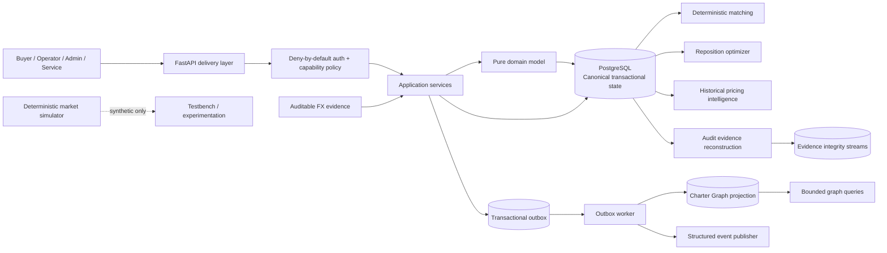
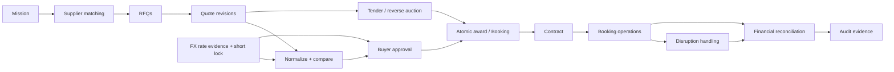

# CharterOS

[](https://github.com/SaridakisStamatisChristos/CharterOS/actions/workflows/ci.yml)


**CharterOS is a deterministic transaction, procurement, operations, optimization, and evidence platform for B2B aviation charter.**

It models the charter lifecycle from buyer mission creation and supplier sourcing through RFQs, quotes, tenders, award, booking, contract, operations, disruption handling, financial reconciliation, audit evidence, and auditable FX—while keeping PostgreSQL as the canonical source of truth and making derived graph, analytical, optimization, and simulation layers explicitly non-canonical.

> **Repository status:** active development on a production-oriented modular-monolith architecture. `main` is protected by a full CI gate covering static analysis, migrations, PostgreSQL integration tests, deterministic solver benchmarking, container hardening, vulnerability scanning, secret scanning, runtime smoke testing, and CycloneDX SBOM generation.

---

## Why CharterOS exists

Private aviation charter is not just a search problem. A serious B2B platform has to preserve commercial intent, supplier eligibility, aircraft continuity, bid confidentiality, exact pricing, approval authority, operational changes, settlement evidence, and historical causality under concurrency and retries.

CharterOS is designed around those constraints.

The system deliberately separates:

- **transactional truth** from projections and analytics;
- **event time** from system knowledge time;
- **recommendation** from authoritative mutation;
- **supplier pricing** from FX conversion;
- **pre-award approval** from award;
- **post-booking disruption decisions** from original procurement;
- **financial reconciliation evidence** from payment settlement;
- **synthetic simulation data** from production evidence;
- **authentication** from caller-supplied tenant selectors.

The result is an auditable core that can support portals, integrations, optimization, historical intelligence, and future automation without allowing those layers to silently become competing sources of truth.

---

## Capabilities

| Area | Implemented capability |
| --- | --- |
| Catalog | Organizations, operators, airports, aircraft types, aircraft registration |
| Fleet state | Bitemporal aircraft position and availability history with explicit corrections |
| Mission lifecycle | Canonical buyer mission state with explicit lifecycle transitions |
| Matching | Deterministic feasibility and ranking with explainable reason codes |
| RFQ | Supplier eligibility, response deadlines, acknowledgement, decline, expiry |
| Quotes | Immutable revision lineage, normalization, comparison, acceptance and rejection |
| Tenders | Sealed reverse auctions, invitations, revisions, BAFO, award and admin corrections |
| Buyer procurement | Buyer-scoped sourcing, comparisons, pre-award approvals and award |
| Operator portal | Fleet, availability, RFQ inbox, quotes, mission calendar, bookings, empty legs |
| Booking & contract | Atomic quote award, explicit booking workflow, bilateral contract acceptance |
| Charter Graph | Versioned event-derived graph projection with rebuild and verification |
| Graph queries | Bounded route, lineage, position, feasible-aircraft and empty-leg queries |
| Repositioning | Exact deterministic deadhead/reposition optimizer with auditable economics |
| Market simulation | Deterministic synthetic market scenarios isolated from production truth |
| Pricing intelligence | Read-only historical feature/outcome dataset with no-hindsight semantics |
| Disruption management | Explicit replacement, commercial-change, buyer-decision and resolution evidence |
| Reconciliation | Immutable invoice revisions, disputes, variance approvals and final payable |
| Audit evidence | Deterministic evidence reconstruction with policy/version provenance |
| FX | Bitemporal immutable rate evidence and short-lived executable buyer FX locks |
| Security | Deny-by-default OIDC/JWT capability authorization with exhaustive route policy |
| Abuse resistance | Bounded bodies/queries, shared expensive-work budgets, JWKS storm suppression and replay-state retention |
| Evidence integrity | PostgreSQL-enforced immutability plus deterministic hash-chained integrity streams |
| Event delivery | Transactional outbox, fenced leases, retry/poison handling and durable deduplication |

---

## System architecture

CharterOS remains a **modular monolith** on purpose. Business transactions stay local and explicit while worker, projection, query, optimization, simulation, and integration seams remain independently evolvable.



### Layering

| Layer | Responsibility |
| --- | --- |
| `charteros/domain` | Aggregates, value objects, invariants, exact money/time rules; no FastAPI or ORM dependency |
| `charteros/application` | Use-case orchestration, ports, transaction-level business workflows |
| `charteros/infrastructure` | SQLAlchemy persistence, projection storage, outbox adapters, integrity integration |
| `apps` | FastAPI, outbox worker, graph projection CLI, pricing-intelligence CLI |
| `charteros/matching` | Deterministic matching primitives and policy |
| `charteros/repositioning` | Reposition economics and exact assignment solver |
| `charteros/simulation` | Deterministic synthetic market model |
| `charteros/pricing_intelligence` | Canonical historical dataset representation |
| `charteros/security` | Authentication identities, permissions and OIDC/JWT verification |
| `charteros/shared` | Configuration, clock, logging, request context and shared runtime primitives |

PostgreSQL is the canonical operational store. The Charter Graph, evidence packages, historical datasets, optimizer outputs, and simulator outputs have explicitly narrower authority.

---

## Core procurement flow



### Authority boundaries

The lifecycle is intentionally not implemented as one mutable mega-record.

- A **Mission** owns buyer intent and sourcing lifecycle.
- An **RFQ** is supplier-directed procurement evidence.
- A **Quote** is immutable commercial revision evidence.
- A **Tender** governs sealed multi-supplier competition where applicable.
- A **ProcurementApproval** records a buyer decision before award; it is not award authority.
- **BookingService** is the canonical award serialization boundary.
- A **Contract** records bilateral acceptance without rewriting the original Quote.
- A **Disruption** records post-booking operational changes without rewriting original award history.
- **FinancialReconciliation** records invoice/dispute/variance evidence without claiming payment settlement.
- **FxLock** records a bounded cross-currency commitment without mutating supplier Quotes.

---

## Design invariants

### 1. PostgreSQL is authoritative

Transactional business state lives in PostgreSQL. The Charter Graph is a rebuildable read model. Analytics, simulation, optimization, and evidence packages cannot silently become command authority.

### 2. Exact money, explicit currency

Money is represented as signed 64-bit integer minor units with explicit currency. Core pricing logic does not use floating-point money.

Cross-currency comparison is unavailable unless explicit FX evidence exists.

### 3. Time is explicit

CharterOS distinguishes:

- `occurred_at` — when a business fact occurred;
- `recorded_at` — when CharterOS learned/recorded it;
- domain validity intervals;
- decision/evaluation cutoffs.

Domain code does not read the system wall clock directly. Temporal authority is passed explicitly through the shared `Clock` boundary.

Naive datetimes fail closed; accepted timestamps are UTC-aware.

### 4. No hindsight

Historical decisions do not see evidence learned later.

Examples include aircraft position lookup, matching snapshots, pricing-intelligence features, graph knowledge cutoffs, and FX-rate resolution. Historical event time alone is insufficient if the system did not know the fact at the decision cutoff.

### 5. Immutable commercial lineage

Quote revisions, tender bid revisions, disruption proposals, commercial changes, operator invoices, FX rate corrections, and decision evidence retain explicit supersession/lineage instead of rewriting history.

### 6. Recommendation is not mutation

Matching and repositioning produce deterministic decision support. The reposition optimizer does not auto-book or silently mutate procurement state.

### 7. Fail closed on ambiguity

CharterOS prefers explicit failure over invented state:

- no hidden FX;
- no reciprocal-rate inference;
- no FX triangulation;
- no graph-as-authority shortcut;
- no missing Tender capability bypass;
- no stale approval award;
- no historical evidence gaps silently skipped;
- no unconfigured protected API route.

---

## Deterministic matching and reposition optimization

### Matching

The matching layer performs deterministic aircraft/supplier feasibility and ranking using canonical Mission, fleet, operator, aircraft, position, availability, and reference-profile evidence.

The output is explainable and includes feasibility/ranking evidence rather than an opaque learned score. Machine learning is not part of the production matching authority.

### Repositioning / deadhead optimizer

The reposition optimizer evaluates whether a structural empty-leg window can profitably contain one quoted revenue mission while preserving aircraft continuity.

It evaluates:

- previous revenue-flight timing;
- aircraft availability;
- baseline direct reposition feasibility;
- pre-reposition;
- candidate revenue leg;
- post-reposition;
- turnaround buffers;
- aircraft/operator eligibility;
- exact operating-cost economics;
- quote revenue and pricing-confidence evidence.

The current `reposition-v2` policy uses an **exact shortest-augmenting-path Hungarian assignment** with deterministic canonical tie semantics. The objective remains continuity-adjusted margin; tie handling cannot override the documented economic objective.

### Validated capacity envelope

Current application and API contracts deliberately enforce:

| Dimension | Validated bound |
| --- | ---: |
| Structural empty legs | **100** |
| Quoted future legs | **2,000** |
| Approximate dense candidate edges | **200,000** |

The canonical final tie-break uses mixed-radix lexicographic encoding whose integer width grows approximately as:

```text
(R + 1)^L
```

where `L` is the structural empty-leg count and `R` is the right-side Mission count.

A workload above 100 structural empty legs is **unvalidated**, not declared mathematically invalid. Raising the cap requires new benchmark evidence; CI contains a deterministic solver benchmark rather than a flaky hosted-runner latency threshold.

See [ADR 0018](docs/adr/0018-repositioning-deadhead-optimizer.md).

---

## Event model and transactional outbox

Domain mutations emit immutable canonical events in the same PostgreSQL transaction as business state.

The outbox provides **at-least-once delivery** with:

- stable event IDs;
- aggregate type / aggregate ID / aggregate version causality;
- `SELECT ... FOR UPDATE SKIP LOCKED` claiming;
- lease owner + UUID fencing token;
- lease expiry and crash recovery;
- deterministic capped exponential retry;
- poison quarantine;
- explicit poison requeue;
- lifetime and current-cycle attempt counters;
- durable consumer receipts;
- PostgreSQL advisory locking for idempotent database consumers.

CharterOS does **not** claim generic exactly-once external side effects. Consumers must honor stable event identity.

Ordering authority is per aggregate, not a fictional global timestamp order. Causal continuity is:

```text
aggregate_type + aggregate_id + aggregate_version
```

The regression suite explicitly covers reversed delivery, gaps, worker races, worker crashes before/after projection commit, poison/requeue convergence, delayed duplicates, and full projection rebuild convergence.

---

## Charter Graph

The Charter Graph is a versioned, event-derived read model stored in PostgreSQL.

It projects aviation/procurement relationships such as:

- operator → aircraft;
- aircraft → home base;
- aircraft → position history;
- mission → origin/destination;
- mission → RFQs;
- RFQ → operator / Quotes;
- Quote → aircraft;
- Quote supersession;
- Mission → Booking;
- Booking → accepted Quote / operator / aircraft.

### Projection lifecycle

```text
building -> verified -> active -> retired
```

Projection changes require a version. Rebuilds never overwrite the active projection.

Verification independently reconstructs expected state from immutable event history and checks:

- projected event count;
- durable consumer receipts;
- aggregate cursor continuity;
- nodes and edges;
- edge endpoints;
- checkpoint state;
- deterministic graph digest.

Operational commands:

```bash
make graph-status
make graph-rebuild
make graph-verify

# Direct CLI equivalents
python -m apps.graph_projection.main status
python -m apps.graph_projection.main rebuild --target-version 1
python -m apps.graph_projection.main verify --version 1
python -m apps.graph_projection.main activate --version 1 --maintenance-mode
```

Activation requires explicit maintenance mode because the final pointer switch assumes writers/workers are quiesced.

---

## Bitemporal fleet state and no-hindsight queries

Aircraft position and availability are historical evidence rather than lossy “current state” fields.

Fleet reads support:

- position observations with event and recording time;
- availability intervals;
- explicit correction via supersession;
- half-open temporal semantics;
- `known_as_of` knowledge cutoffs;
- historical state reconstruction.

The same temporal discipline is reused by matching, operator views, pricing intelligence, disruption recovery, graph queries, and FX.

---

## Tender / reverse auction

Tender procurement supports:

- explicit open/deadline window;
- supplier invitations;
- acceptance/decline;
- initial bids;
- immutable bid revisions;
- optional best-and-final round;
- bid withdrawal;
- closing;
- award;
- append-only administrative corrections.

Supplier-side changes at or after the authoritative deadline fail closed.

Sealed Tender evidence is intentionally protected from generic Quote, analytics, audit, and portal surfaces while the confidentiality window is active.

Tender workflows reuse the existing Mission/RFQ/Quote/Booking authorities rather than creating a second procurement engine.

---

## Buyer and operator portals

CharterOS exposes scoped workflow composition surfaces rather than portal-specific duplicate databases.

### Buyer portal

Representative operations:

- create/open Mission;
- deterministic supplier search;
- issue/read RFQs;
- compare current Quotes;
- create short-lived FX locks;
- approve an immutable Quote revision;
- award through canonical Booking authority;
- retrieve resulting Booking;
- inspect bounded procurement event metadata.

### Operator portal

Representative operations:

- fleet list/detail/creation;
- bitemporal availability;
- RFQ inbox/detail;
- acknowledgement/decline;
- Quote submit/revise/withdraw;
- own-Quote access under sealed Tender rules;
- mission calendar;
- booking list/detail;
- structural and optimized empty-leg visibility.

Portal contexts are authorization scopes, not alternate domain authority.

---

## Disruption management

CharterOS models post-booking disruption as explicit evidence rather than editing the original award.

Supported disruption categories include delay, aircraft unavailable, crew unavailable, airport restriction, technical, weather, and other.

A Disruption can preserve:

- immutable replacement/remediation proposal revisions;
- canonical aircraft/operator version evidence;
- bitemporal availability evidence;
- immutable commercial-change revisions;
- buyer approval/rejection bound to exact evidence;
- terminal resolution with observed Booking state.

The original accepted Quote and Booking lineage remain intact.

Cross-operator recovery is deliberately not smuggled through the disruption workflow as a second award path.

---

## Financial reconciliation

A completed Booking may enter one canonical FinancialReconciliation.

The model preserves:

- immutable booked commercial reference;
- immutable operator invoice revisions;
- invoice line items;
- exact invoice totals;
- exact variance;
- disputes tied to the current invoice revision;
- variance approvals;
- final payable;
- atomic transition of the Booking to reconciled state.

CharterOS does **not** claim to move money, settle payment rails, or post an accounting ledger. `final_payable` is reconciliation evidence.

---

## Auditable FX

Supplier Quotes remain canonical in their original currency.

FX is a separate evidence layer with two concepts:

### `FxRateObservation`

Immutable directional rate evidence with:

- source and target currency;
- exact decimal rate string;
- minor-unit exponents;
- source identity;
- market/effective timestamp;
- recorded timestamp;
- append-only correction lineage.

No reciprocal-rate inference and no triangulation are performed.

### `FxLock`

A short-lived executable buyer commitment containing the exact:

- buyer and Mission;
- eligible immutable Quote revisions;
- original normalized totals;
- rate evidence IDs;
- converted totals;
- global score/rank;
- policy versions;
- deterministic digest;
- lock and expiry timestamps;
- consumption evidence.

Current policy uses a **30-second half-open lock window**.

Conversion uses `Decimal` under controlled precision and rounds only at the target minor-unit boundary. No floating-point FX math is allowed.

The lock is consumed at approval; later market changes do not rewrite historical approval evidence.

---

## Audit evidence and database-enforced integrity

### Evidence reconstruction

The `audit-evidence-v1` layer reconstructs bounded evidence packages for Missions, Bookings, Disruptions, and Financial Reconciliations.

Packages contain curated facts, canonical source references, policy/version identifiers, event lineage, decision snapshots, and a deterministic SHA-256 content digest.

Evidence reads execute under `REPEATABLE READ, READ ONLY`.

The digest is reproducibility/tamper-detection evidence—not a digital signature, external timestamp, or notarization claim.

### PostgreSQL integrity boundary

PR28 hardening moves important evidence immutability below the ORM layer.

Protected evidence uses:

- runtime privilege separation;
- append-only tables where appropriate;
- `ENABLE ALWAYS` mutation guards for immutable fields;
- delete rejection;
- deterministic `evidence_integrity_entries` streams;
- per-stream advisory locks;
- monotonic sequence;
- previous-digest linkage;
- SHA-256 integrity digest;
- optional internal checkpoints;
- source-row verification.

Production application/worker identities should use the non-owner runtime role configured via `CHARTEROS_DATABASE_RUNTIME_ROLE`. The schema owner remains reserved for migrations, controlled recovery, and forensic operations.

See [database-enforced evidence integrity](docs/evidence-integrity.md).

---

## Authentication and authorization

Every `/v1` route is protected by a centralized **deny-by-default** policy.

Production authentication uses OIDC-compatible asymmetric JWT verification against configured JWKS.

Validation includes:

- allowed asymmetric algorithm;
- `kid`;
- cryptographic signature;
- issuer;
- audience;
- `exp`;
- `iat`;
- `nbf` when present;
- `sub`;
- CharterOS principal/permission claims.

`alg=none` and symmetric HMAC authentication are rejected.

### Principal types

- buyer
- operator
- administrator
- service

### Tenant selectors

`X-Buyer-Id` and `X-Operator-Id` are **selectors only**. They do not authenticate the caller.

A verified token can select only memberships present in its signed claims unless an administrator also has the explicit `tenant:admin` capability.

### Exhaustive route policy

`apps/api/route_security.py::ROUTE_POLICIES` is the authoritative protected-route inventory.

Tests compare it with the actual FastAPI `/v1` routes. Adding a protected route without an explicit policy fails CI.

### Public runtime endpoints

- `GET /health` — process health metadata;
- `GET /ready` — PostgreSQL readiness.

In non-production environments, `/docs` and `/openapi.json` are enabled. Production disables both.

If OIDC configuration is absent, the protected API fails closed. There is no production header or environment-variable authentication bypass.

See [authentication and authorization](docs/authentication-authorization.md).

---

## API abuse and resource bounds

CharterOS separates **general edge rate limiting** from **application-owned computation bounds**.

Staging and production require trusted ingress/API-gateway rate limiting for general and anonymous traffic. The application does not pretend a process-local counter would be correct across replicas.

Inside CharterOS, PostgreSQL-backed fixed-window budgets are shared across API replicas for matching, reposition optimization / optimized empty-leg visibility, evidence reconstruction, and Charter Graph queries. Budget identity is SHA-256-derived from the verified principal plus validated tenant selector; raw principal/tenant identifiers are not persisted in the limiter table.

Additional hard bounds include:

- 1 MiB default request body;
- JSON nesting depth 32;
- 10-second request-body receive timeout;
- bounded Pydantic collection counts and item lengths;
- 366-day fleet/calendar query windows;
- 31-day optimization/empty-leg windows;
- JWKS document/key/refresh bounds and short unknown-key negative caching;
- 256 KiB database-enforced idempotency response storage;
- 90-day default idempotency replay-retention policy with bounded cleanup batches.

See [ADR 0033](docs/adr/0033-api-abuse-resource-bounds.md).

---

## API surfaces

CharterOS currently exposes these major route families:

| Surface | Prefix / representative routes |
| --- | --- |
| Catalog | `/v1/organizations`, `/v1/operators`, `/v1/airports`, `/v1/aircraft` |
| Fleet timeline | `/v1/aircraft/{id}/positions`, `/availability`, `/timeline` |
| Missions | `/v1/missions/*` |
| Matching | `/v1/missions/{id}/matches` |
| RFQs | `/v1/missions/{id}/rfqs`, `/v1/rfqs/*` |
| Quotes | `/v1/rfqs/{id}/quotes`, `/v1/quotes/*`, Mission comparison |
| Bookings | Quote acceptance plus explicit Booking lifecycle transitions |
| Contracts | Booking contract creation and bilateral acceptance |
| Tenders | `/v1/tenders/*` and `/v1/tender-invitations/*` |
| Charter Graph | `/v1/graph/*` |
| Repositioning | `GET /v1/optimization/repositioning` |
| Buyer portal | `/v1/buyer-portal/*` |
| Operator portal | `/v1/operator-portal/*` |
| Disruptions | Booking disruption creation, proposals, requotes, decisions, resolution |
| Reconciliation | Booking reconciliation, invoices, disputes, approvals, completion |
| Evidence | `/v1/evidence/*` |
| FX | `/v1/fx/rates*` plus buyer FX-lock creation |

For the exact schema and current endpoint inventory, run CharterOS outside production and use `/docs` or `/openapi.json`.

---

## Deterministic simulation and historical intelligence

### Market simulator

`charteros.simulation` provides `market-sim-v1` deterministic synthetic scenarios.

Random-looking choices are derived from SHA-256-addressed semantic labels rather than process-global RNG order. The same policy, seed, and configuration/reference state produce the same scenario.

Simulation output is explicitly marked synthetic and never writes canonical Mission, Quote, Booking, Tender, outbox, or Charter Graph state.

### Pricing intelligence

The historical pricing builder creates `pricing-dataset-v1` from canonical PostgreSQL history.

Features include route, aircraft category, lead time, weekday/season, operator, quote-time aircraft position, quote revision, normalized totals, pricing confidence, and later outcome labels.

Important constraints:

- quote-time features are separated from later labels;
- no-hindsight position rules are enforced;
- Quote normalization is reused rather than reimplemented;
- active sealed-Tender evidence is excluded;
- multi-currency datasets remain globally incomparable without FX;
- source reads use `REPEATABLE READ, READ ONLY`;
- v1 is bounded to 5,000 rows and a 3,660-day source window.

Example:

```bash
python -m apps.pricing_intelligence.main \
  --window-start 2026-01-01T00:00:00+00:00 \
  --window-end 2026-02-01T00:00:00+00:00 \
  --limit 1000
```

---

## Quick start

### Requirements

- Python **3.13+**
- PostgreSQL **17** recommended
- Docker + Docker Compose
- GNU Make optional
- `uv 0.12.21` for the repository's pinned workflow

### 1. Configure

```bash
cp .env.example .env
```

Replace the development PostgreSQL password in `.env`. Never use the example password in a real deployment.

### 2. Install

```bash
python -m pip install "uv==0.12.21"
uv sync --frozen --extra dev
```

### 3. Start PostgreSQL

```bash
docker compose up -d postgres
```

### 4. Apply migrations

```bash
uv run alembic upgrade head
```

### 5. Run the API

```bash
uv run python -m apps.api
```

Then:

- health: `http://127.0.0.1:8000/health`
- readiness: `http://127.0.0.1:8000/ready`
- development docs: `http://127.0.0.1:8000/docs`

Protected `/v1` routes require a valid configured OIDC/JWT identity. With no OIDC configuration, the protected API intentionally rejects requests.

### Docker Compose runtime

After migrations:

```bash
docker compose up --build api outbox-worker
```

The Compose services run with a read-only root filesystem, all Linux capabilities dropped, `no-new-privileges`, and a bounded `/tmp` tmpfs.

---

## Configuration

Runtime settings use the `CHARTEROS_` prefix.

Important settings include:

| Setting | Purpose |
| --- | --- |
| `CHARTEROS_DATABASE_URL` | Required PostgreSQL SQLAlchemy URL |
| `CHARTEROS_DATABASE_RUNTIME_ROLE` | Optional non-owner runtime role |
| `CHARTEROS_DATABASE_POOL_SIZE` | Bounded persistent connection pool size |
| `CHARTEROS_DATABASE_MAX_OVERFLOW` | Bounded overflow connections |
| `CHARTEROS_DATABASE_POOL_TIMEOUT_SECONDS` | Maximum pool checkout wait |
| `CHARTEROS_DATABASE_POOL_RECYCLE_SECONDS` | Connection recycle interval |
| `CHARTEROS_DATABASE_CONNECT_TIMEOUT_SECONDS` | PostgreSQL connect timeout |
| `CHARTEROS_ENVIRONMENT` | development / test / staging / production |
| `CHARTEROS_API_HOST` / `PORT` | API bind configuration |
| `CHARTEROS_API_MAX_REQUEST_BODY_BYTES` | Maximum buffered request body |
| `CHARTEROS_API_MAX_JSON_DEPTH` | Maximum JSON object/array nesting |
| `CHARTEROS_API_REQUEST_BODY_READ_TIMEOUT_SECONDS` | Pre-route body receive timeout |
| `CHARTEROS_TRUSTED_INGRESS_RATE_LIMIT_ENFORCED` | Required staging/production ingress contract |
| `CHARTEROS_API_*_REQUESTS_PER_WINDOW` | Shared expensive-work request budgets |
| `CHARTEROS_AUTH_ISSUER` | OIDC issuer |
| `CHARTEROS_AUTH_AUDIENCE` | OIDC audience |
| `CHARTEROS_AUTH_JWKS_URL` | JWKS endpoint |
| `CHARTEROS_AUTH_ALLOWED_ALGORITHMS` | Allowed asymmetric JWT algorithms |
| `CHARTEROS_AUTH_JWKS_MAX_DOCUMENT_BYTES` | Maximum JWKS document size |
| `CHARTEROS_AUTH_JWKS_REFRESH_MIN_INTERVAL_SECONDS` | Refresh-storm suppression interval |
| `CHARTEROS_IDEMPOTENCY_RETENTION_DAYS` | Replay-record retention contract |
| `CHARTEROS_IDEMPOTENCY_CLEANUP_BATCH_SIZE` | Bounded cleanup work per invocation |
| `CHARTEROS_OUTBOX_BATCH_SIZE` | Worker claim batch |
| `CHARTEROS_OUTBOX_LEASE_SECONDS` | Delivery lease duration |
| `CHARTEROS_OUTBOX_MAX_ATTEMPTS` | Retry budget |
| `CHARTEROS_OUTBOX_BACKOFF_*` | Deterministic retry policy |

Staging and production require the complete issuer/audience/JWKS tuple and explicit trusted-ingress rate-limit enforcement. Production rejects DEBUG logging and known development database passwords.

See [.env.example](.env.example).

---

## Operational processes

### Outbox worker

```bash
make outbox-worker
make outbox-worker-once

# Requeue one explicitly poisoned event
python -m apps.outbox_worker.main --requeue-poison <event-uuid> --once
```

The worker publishes into the active Charter Graph projection and the structured JSON event publisher through one composite publisher boundary.

### Charter Graph

```bash
make graph-status
make graph-rebuild
make graph-verify
```

### Replay / abuse transient-state cleanup

Run one bounded cleanup batch:

```bash
make resource-cleanup
# or
python -m apps.resource_cleanup.main
```

Schedule repeated invocations externally. The command deletes only expired idempotency replay records and transient API rate-window rows; it does not delete authoritative business/evidence data.

### Database runtime role

After schema migration, provision/apply the restricted runtime role using:

```text
deploy/postgres/evidence_runtime_role.sql
```

Do not run ordinary application traffic as the schema owner or PostgreSQL superuser.

---

## Quality gate

The repository's GitHub Actions pipeline executes the following gate on pull requests and `main`:

1. pinned Python 3.13.15;
2. pinned `uv` installation with checksum verification;
3. dependency-lock verification;
4. frozen environment sync;
5. Ruff lint;
6. Ruff format check;
7. strict mypy across apps, core, tests and tools;
8. Bandit static security analysis;
9. `pip-audit` dependency vulnerability audit;
10. Docker Compose configuration validation;
11. Alembic migration smoke;
12. Alembic schema-drift check;
13. full pytest suite against PostgreSQL 17;
14. PostgreSQL restart / stale-connection recovery smoke;
15. reposition solver benchmark;
16. API boot smoke;
17. pinned Trivy installation with checksum verification;
18. repository secret scan;
19. hardened container image build;
20. read-only/capability-dropped runtime smoke;
21. HIGH/CRITICAL container vulnerability scan;
22. CycloneDX SBOM generation and validation.

Run the primary developer gate locally:

```bash
uv lock --check
uv run ruff check .
uv run ruff format --check .
uv run mypy apps charteros tests tools
uv run bandit -q -r apps charteros tools
uv export --frozen --no-dev --no-emit-project --no-hashes \
  --format requirements-txt \
  --output-file /tmp/runtime-requirements.txt
uv run pip-audit --strict --no-deps -r /tmp/runtime-requirements.txt
docker compose config
uv run alembic upgrade head
uv run alembic check
uv run pytest
uv run python tools/benchmark_reposition_solver.py
uv run python tools/app_boot_smoke.py
```

Or use:

```bash
make quality
```

Test markers distinguish integration, property, regression, and concurrency suites.

---

## Repository layout

```text
CharterOS/
├── apps/
│   ├── api/                    # FastAPI delivery + route security
│   ├── graph_projection/       # rebuild / verify / activate CLI
│   ├── outbox_worker/          # leased asynchronous delivery worker
│   ├── pricing_intelligence/   # deterministic historical dataset CLI
│   └── resource_cleanup/       # bounded idempotency/rate-window cleanup CLI
├── charteros/
│   ├── application/            # use cases and application ports
│   ├── domain/                 # pure business model and invariants
│   ├── infrastructure/         # SQLAlchemy, repositories, projections, integrity
│   ├── matching/               # deterministic matching policy
│   ├── outbox/                 # delivery engine abstractions
│   ├── pricing_intelligence/   # historical dataset model
│   ├── repositioning/          # exact optimizer + economics
│   ├── security/               # authentication model and JWT verification
│   ├── shared/                 # config, clock, logging, context
│   └── simulation/             # deterministic synthetic market simulator
├── deploy/postgres/            # database runtime-role hardening
├── docs/
│   ├── adr/                    # durable architecture decisions
│   ├── architecture/           # architecture notes
│   ├── authentication-authorization.md
│   └── evidence-integrity.md
├── migrations/versions/        # Alembic schema history
├── test-assets/                # deterministic reference assets
├── tests/                      # unit, property, regression, concurrency, integration
├── tools/
│   ├── app_boot_smoke.py
│   └── benchmark_reposition_solver.py
├── Dockerfile
├── docker-compose.yml
├── pyproject.toml
└── uv.lock
```

---

## Architecture Decision Records

The ADR history is the detailed design authority for the major subsystems.

| ADR | Decision |
| --- | --- |
| [0001](docs/adr/0001-modular-monolith-postgresql-foundation.md) | Modular monolith + PostgreSQL foundation |
| [0002](docs/adr/0002-shared-domain-primitives.md) | Shared domain primitives |
| [0003](docs/adr/0003-catalog-core-persistence.md) | Catalog persistence |
| [0004](docs/adr/0004-bitemporal-aircraft-timeline.md) | Bitemporal aircraft timeline |
| [0005](docs/adr/0005-mission-domain-lifecycle.md) | Mission lifecycle |
| [0006](docs/adr/0006-deterministic-matching-v1.md) | Deterministic matching |
| [0007](docs/adr/0007-rfq-engine.md) | RFQ engine |
| [0008](docs/adr/0008-quote-engine.md) | Quote engine |
| [0009](docs/adr/0009-quote-normalization.md) | Quote normalization |
| [0010](docs/adr/0010-quote-comparison.md) | Quote comparison |
| [0011](docs/adr/0011-quote-acceptance-booking.md) | Atomic Quote acceptance / Booking |
| [0012](docs/adr/0012-contract-layer.md) | Contract layer |
| [0013](docs/adr/0013-booking-workflow.md) | Booking workflow |
| [0014](docs/adr/0014-transactional-outbox.md) | Production transactional outbox |
| [0015](docs/adr/0015-charter-graph-projection.md) | Charter Graph projection |
| [0016](docs/adr/0016-graph-query-layer.md) | Bounded graph queries |
| [0017](docs/adr/0017-tender-reverse-auction.md) | Tender / reverse auction |
| [0018](docs/adr/0018-repositioning-deadhead-optimizer.md) | Reposition / deadhead optimizer |
| [0019](docs/adr/0019-market-simulator.md) | Deterministic market simulator |
| [0020](docs/adr/0020-pricing-historical-intelligence.md) | Pricing historical intelligence |
| [0021](docs/adr/0021-operator-portal-apis.md) | Operator portal |
| [0022](docs/adr/0022-buyer-procurement-apis.md) | Buyer procurement |
| [0023](docs/adr/0023-disruption-model.md) | Disruption model |
| [0024](docs/adr/0024-financial-reconciliation.md) | Financial reconciliation |
| [0025](docs/adr/0025-audit-evidence-layer.md) | Audit evidence |
| [0026](docs/adr/0026-auditable-fx-policy.md) | Auditable FX |
| [0032](docs/adr/0032-transaction-failure-and-ambiguous-commit.md) | Transaction failure and ambiguous-commit semantics |
| [0033](docs/adr/0033-api-abuse-resource-bounds.md) | API abuse and resource-exhaustion boundaries |

Later hardening is additionally encoded in the implementation, focused documentation, and regression suites for authentication, database evidence integrity, event-ordering assurance, explicit clock authority, deterministic solver tie semantics, and the validated optimizer capacity envelope.

---

## Explicit boundaries

CharterOS intentionally does **not** claim capabilities it does not provide.

Current boundaries include:

- no graph-backed transactional business authority;
- no generic exactly-once guarantee for arbitrary external effects;
- no hidden or implicit FX;
- no floating-point money;
- no automatic booking from optimizer recommendations;
- no production ML ranking/award authority;
- no cross-operator disruption re-award shortcut;
- no payment-rail settlement or accounting ledger;
- no claim that internal SHA-256 evidence digests are legal signatures;
- no KMS/HSM signing or external notarization unless a real provider is separately implemented and exercised;
- no production authentication bypass when OIDC is absent.

These boundaries are part of the architecture, not missing error handling.

---

## Technology

- **Python 3.13**
- **FastAPI**
- **Pydantic v2 / pydantic-settings**
- **SQLAlchemy 2**
- **PostgreSQL 17**
- **Alembic**
- **PyJWT + asymmetric JWKS/OIDC**
- **uv**
- **pytest + Hypothesis**
- **Ruff**
- **mypy strict**
- **Bandit**
- **pip-audit**
- **Docker / Docker Compose**
- **Trivy**
- **CycloneDX SBOM**

No Redis, Kafka, Celery, external graph database, or Kubernetes dependency is required by the current architecture.

---

## License

**CharterOS is proprietary software. It is not open source.**

Public repository visibility grants only the limited non-commercial internal evaluation rights stated in [LICENSE](LICENSE).

Without a separate written agreement, the license does not authorize production use, commercial use, redistribution, derivative works, hosted/managed-service use, competitive implementation, AI/ML training use, sublicensing, or broader exploitation.

Copyright © 2026 Stamatis-Christos Saridakis. All Rights Reserved.
