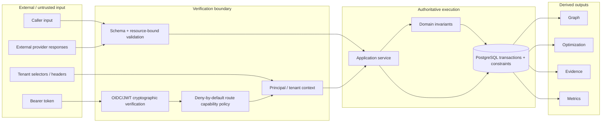

# CharterOS authority and trust boundaries

This document answers two reviewer questions:

1. **What is allowed to decide or mutate business truth?**
2. **Where does CharterOS trust external input, and where does it re-establish trust?**

## 1. Authority model

| Component / artifact | May mutate canonical business state? | Purpose |
| --- | :---: | --- |
| Authenticated application service | **Yes** | Executes explicit use cases under domain and DB invariants |
| PostgreSQL constraints / transactions | **Yes** | Final concurrency and integrity arbitration |
| BookingService award boundary | **Yes** | Canonical award/capacity commitment path |
| Governance service | **Yes, bounded** | Policy-driven closure/erasure under legal-hold and dependency rules |
| Matching engine | No | Deterministic feasibility/ranking recommendation |
| Reposition optimizer | No | Deterministic economic recommendation |
| Charter Graph | No | Rebuildable read model |
| Pricing-intelligence dataset | No | Historical analytical representation |
| Evidence package | No | Deterministic reconstruction |
| Recovery verifier | No | Detects inconsistent restored state |
| Prometheus metrics / alerts | No | Operational observation |
| Market simulator | No | Synthetic-only experimentation |

## 2. Trust-boundary view

Tenant selectors are never identity. A caller becomes authoritative only after identity verification,
capability policy, request validation, contextual scoping, application-service checks, domain
invariants, and database arbitration.

## 3. Failure posture

CharterOS deliberately prefers bounded failure over invented state.

| Ambiguity / failure | Required posture |
| --- | --- |
| Missing or invalid identity evidence | Deny |
| Route without explicit capability policy | Deny |
| Cross-currency comparison without FX evidence | Unavailable |
| Stale pre-award approval | Revalidate / reject |
| Aircraft overlap at commitment | Database rejects one contender |
| Incomplete optimizer universe | Fail closed |
| Ambiguous transaction commit | Reconcile durable authority state before replay |
| Projection gap / order discontinuity | Detect and rebuild/repair projection path; do not invent canonical state |
| Restore inconsistency | Verification fails; no automatic history repair |
| Unvalidated SLO/load threshold | Mark as candidate/unproven, not production fact |

## 4. Evidence classes

CharterOS documentation intentionally separates three classes of evidence:

- **Implementation evidence** — code, database constraints, tests, static checks.
- **Build/release evidence** — CI results, SBOM, provenance, signed release manifest.
- **Live operational evidence** — deployment digest, real alert delivery, measured SLO/load results,
  restore/PITR drills and observed RTO/RPO.

A green CI run can establish the first two classes for a revision. It cannot substitute for the third.

## 5. Security assumptions

- Asymmetric OIDC/JWT verification is the production identity boundary.
- General volumetric rate limiting belongs at trusted ingress.
- Application-owned expensive operations still have hard bounds and shared budgets.
- `/metrics` is intended for a monitoring plane; production ingress must restrict it appropriately.
- Derived state and observability are not authorization or command sources.
- Release attestations establish artifact lineage, not runtime deployment identity.

## 6. Related documents

- [System context and container views](system-context.md)
- [Critical flows](critical-flows.md)
- [Authentication and authorization](../authentication-authorization.md)
- [Evidence integrity](../evidence-integrity.md)
- [Production-readiness assurance](../assurance/production-readiness/README.md)
