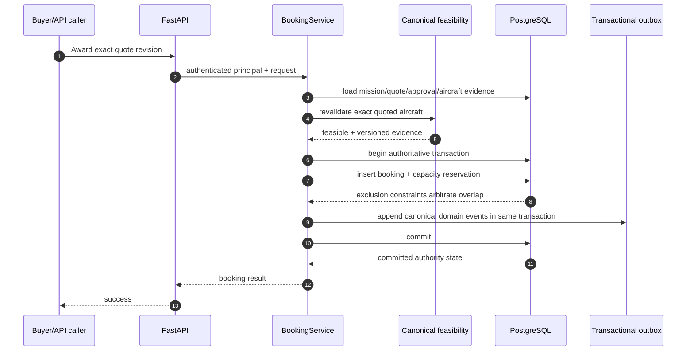
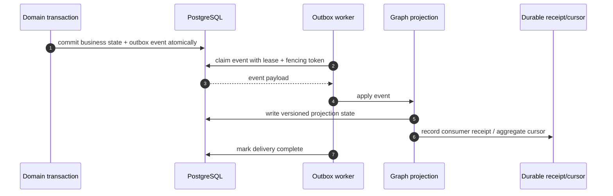
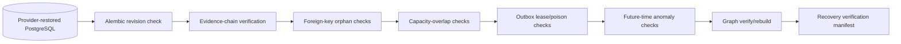
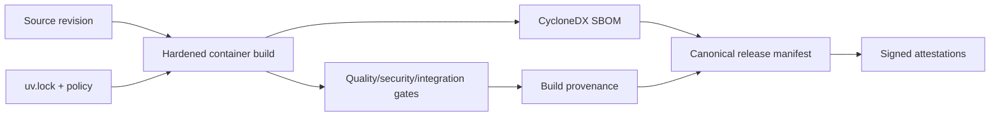

# CharterOS critical flows

These sequence diagrams document the paths where correctness depends on more than one subsystem.
They are reviewer aids, not substitutes for the ADRs or tests.

## 1. Quote award and aircraft-capacity commitment



The critical property is that pre-award approval and recommendation do not reserve capacity. The
authoritative commitment happens at BookingService, after award-time feasibility revalidation, under
database-enforced overlap protection.

## 2. Outbox delivery and Charter Graph projection



Delivery is at-least-once. Stable event identity, aggregate version continuity, fenced leases, durable
receipts, and idempotent projection logic provide replay and crash safety. CharterOS does not claim
generic exactly-once external side effects.

## 3. Ambiguous commit recovery

```mermaid
sequenceDiagram
    autonumber
    participant C as Caller
    participant APP as Application service
    participant DB as PostgreSQL
    participant ID as Idempotency / authority state

    C->>APP: business command + stable identity
    APP->>DB: execute transaction
    DB--xAPP: connection failure during/after commit boundary
    APP->>ID: reconcile durable authority state
    ID-->>APP: committed / not committed / unresolved
    alt committed
        APP-->>C: return/reconstruct committed result
    else not committed
        APP-->>C: safe failure or bounded retry policy
    else unresolved
        APP-->>C: fail closed; do not blindly replay
    end
```

An ambiguous commit is not treated as an ordinary retryable exception. Recovery consults durable
authority/idempotency state before any replay decision.

## 4. Disaster-recovery verification



CharterOS verifies restored state; backup/PITR creation itself is provider-specific. Verification does
not rewrite canonical history, and a rebuilt graph is not auto-activated.

## 5. Release provenance



Release evidence binds source, dependency lock/policy, built artifact, SBOM, provenance, and the
canonical manifest. It proves repository/build lineage; it does not by itself prove that production is
running that digest or meeting production SLOs.

## 6. Operational reading order

For incident or assurance work, pair these flows with:

- [Authority and trust boundaries](authority-and-trust-boundaries.md)
- [ADR 0032 — Transaction failure and ambiguous commit](../adr/0032-transaction-failure-and-ambiguous-commit.md)
- [ADR 0035 — Disaster-recovery assurance](../adr/0035-disaster-recovery-assurance.md)
- [ADR 0036 — Release and supply-chain provenance](../adr/0036-release-supply-chain-provenance.md)
- [PR38–PR42 aircraft commitment hardening](../assurance/pr38-pr42-aircraft-commitment-hardening.md)
