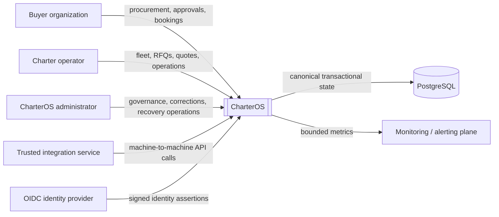
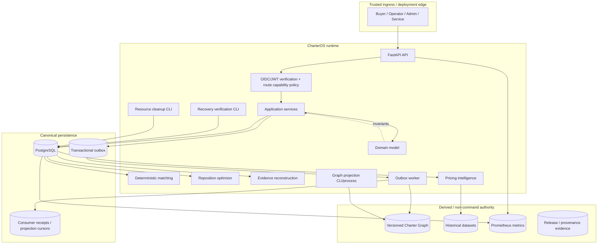
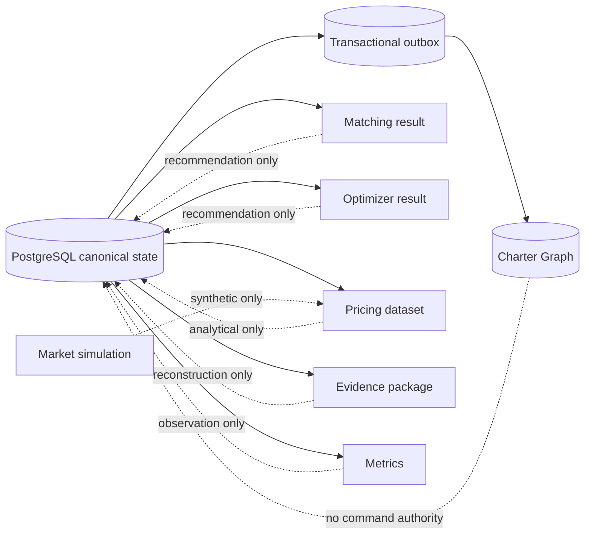
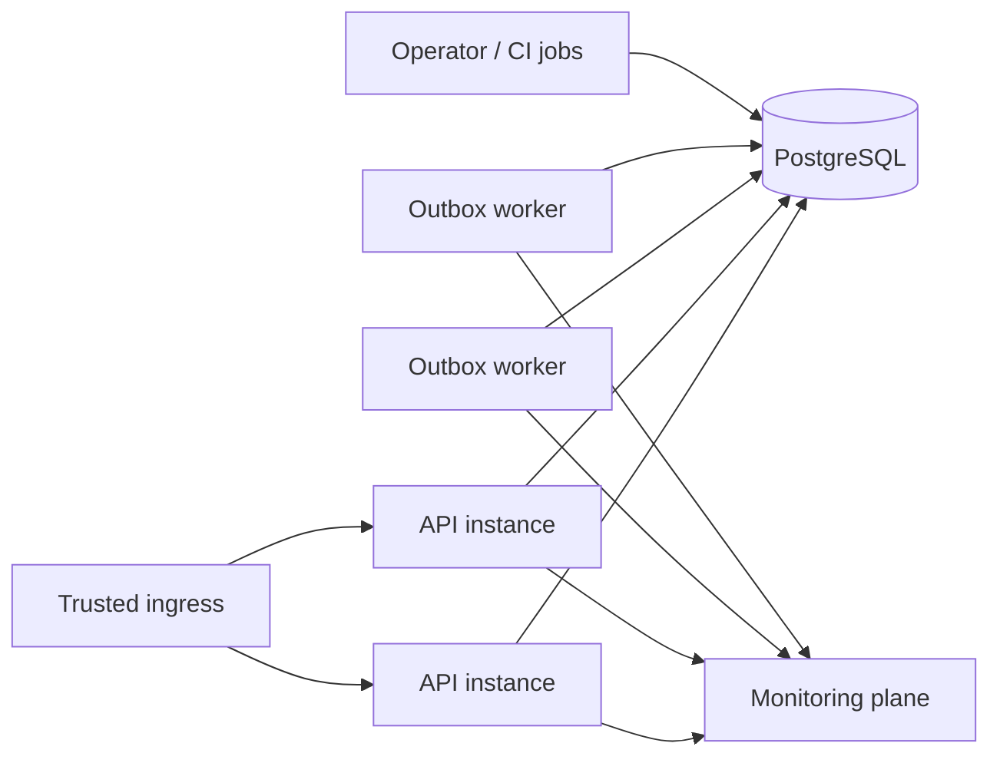

# CharterOS system context and container views

This document is the visual architecture atlas for CharterOS. It complements the durable decisions in
the [ADR index](../adr/README.md) and the narrative [architecture overview](README.md).

The diagrams use a C4-inspired hierarchy without claiming strict C4 notation. Their purpose is to make
system boundaries, authority, runtime responsibility, and derived-state relationships obvious to a
reviewer before they read implementation details.

## 1. System context

### Boundary statement

CharterOS is the application authority for charter procurement and execution workflows. PostgreSQL is
the canonical transactional system of record. Identity providers assert identity; they do not define
CharterOS business authorization. Monitoring observes the system; it does not own business state.

## 2. Runtime container view

## 3. Code-to-runtime map

| Runtime concern | Primary code boundary | Authority |
| --- | --- | --- |
| HTTP delivery | `apps/api` | Delivery only |
| Authentication / authorization | `charteros/security`, API route policy | Identity verification + capability gate |
| Business orchestration | `charteros/application` | Use-case authority |
| Domain invariants | `charteros/domain` | Business-rule authority |
| Canonical persistence | `charteros/infrastructure` + PostgreSQL | Transactional truth |
| Matching | `charteros/matching` | Deterministic recommendation |
| Reposition optimization | `charteros/repositioning` | Deterministic recommendation |
| Event delivery | `charteros/outbox`, `apps/outbox_worker` | At-least-once delivery |
| Graph projection | `charteros/application/graph_projection.py`, infrastructure projection, `apps/graph_projection` | Rebuildable read model |
| Pricing intelligence | `charteros/pricing_intelligence`, `apps/pricing_intelligence` | Historical analytical view |
| Recovery assurance | `apps/recovery_verification` | Verification, never repair authority |
| Resource cleanup | `apps/resource_cleanup` | Bounded maintenance |
| Observability | `charteros/observability.py` + runtime instrumentation | Observation only |

## 4. Canonical versus derived state

A reverse dotted arrow means “must not silently become command authority.” State may be rebuilt,
recomputed, or observed from canonical evidence, but mutations return through explicit application
services and database-enforced invariants.

## 5. Deployment posture

CharterOS is intentionally a modular monolith. The architecture keeps transactional correctness local
while allowing independent process scaling for API, outbox delivery, projection/rebuild work, recovery
verification, and maintenance tooling.

Horizontal process count is not itself a correctness mechanism. Concurrency safety comes from
transaction boundaries, database constraints, fencing, idempotency, and explicit authority checks.

## 6. Related architecture documents

- [Architecture overview](README.md)
- [Critical flows](critical-flows.md)
- [Authority and trust boundaries](authority-and-trust-boundaries.md)
- [Architecture Decision Records](../adr/README.md)
- [Assurance documentation](../assurance/README.md)
